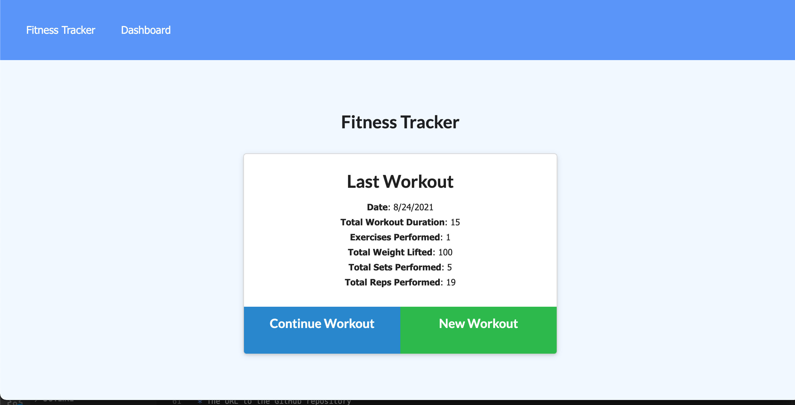
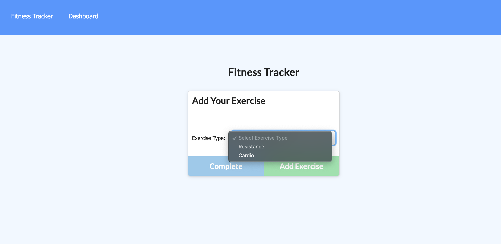
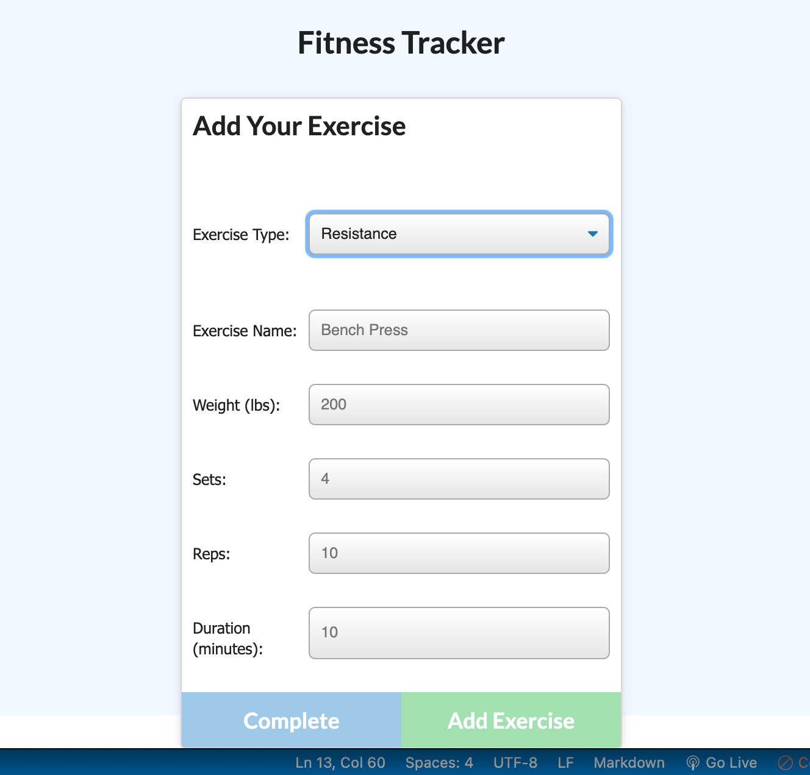
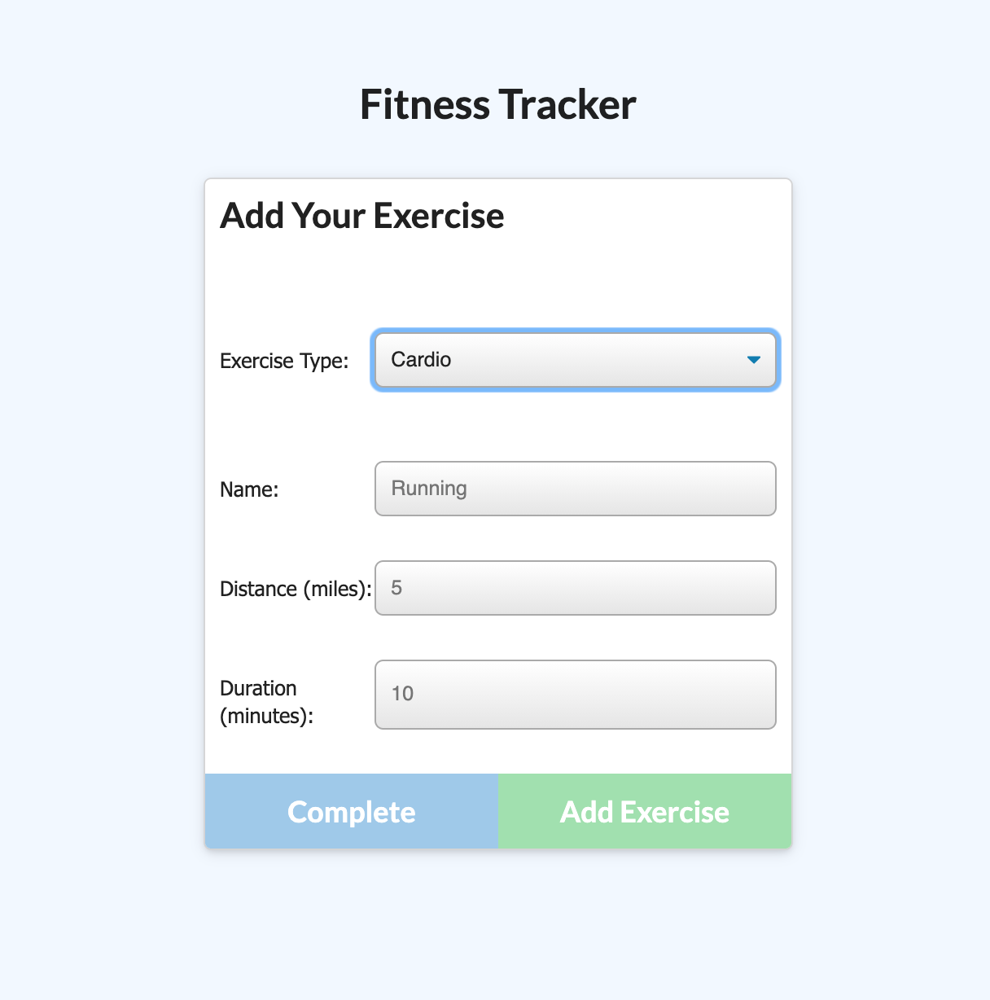
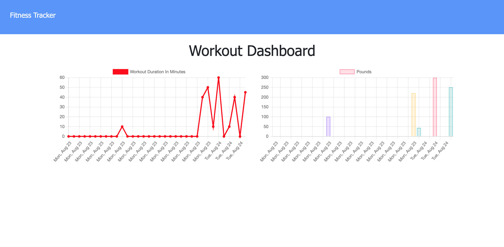

# fitness-tracker

## **Description**  
-------------
An application that was made to help users keep track of their workouts throughout the week. Users are able to see their workout history and data all in one application!

 ## **How to Use**
 ---------------
- The user would start at the homepage where they would be able to see their stats from their past workouts. There they have the option to continue to add to their current workout or to start a new workout entry.

-  The user can select to continue to enter more exercises to their current workout or to start a new workout. This would take them to _Add Your Exercise_ page. Where they can pick to enter a resistance training workout or a cardio workout. 

- When a user selects to enter a resistance workout, they will enter the exercise name, weight (lbs), sets, reps, and duration of the workout. The user would select _Add Exercise_ to submit their workout. Then select _Complete_, which will take them back to the homepage.

- When a user selects to enter a cardio workout, they will enter the exercise name, distance (mi), and duration of the workout. The user would select _Add Exercise_ to submit their workout. Then select _Complete_, which will take them back to the homepage.

- The user can view their saved workouts and data in the dashboard.
  
-

## **Built With**
---------------
- 
- 
- 
- 
- 

## **Contributors**
--------------------
  

- Rudy S. [GitHub](https://github.com/Rudys212)

## **License**
--------------------
MIT License

Copyright (c) 2021 Rudys212

Permission is hereby granted, free of charge, to any person obtaining a copy
of this software and associated documentation files (the "Software"), to deal
in the Software without restriction, including without limitation the rights
to use, copy, modify, merge, publish, distribute, sublicense, and/or sell
copies of the Software, and to permit persons to whom the Software is
furnished to do so, subject to the following conditions:

The above copyright notice and this permission notice shall be included in all
copies or substantial portions of the Software.

THE SOFTWARE IS PROVIDED "AS IS", WITHOUT WARRANTY OF ANY KIND, EXPRESS OR
IMPLIED, INCLUDING BUT NOT LIMITED TO THE WARRANTIES OF MERCHANTABILITY,
FITNESS FOR A PARTICULAR PURPOSE AND NONINFRINGEMENT. IN NO EVENT SHALL THE
AUTHORS OR COPYRIGHT HOLDERS BE LIABLE FOR ANY CLAIM, DAMAGES OR OTHER
LIABILITY, WHETHER IN AN ACTION OF CONTRACT, TORT OR OTHERWISE, ARISING FROM,
OUT OF OR IN CONNECTION WITH THE SOFTWARE OR THE USE OR OTHER DEALINGS IN THE
SOFTWARE.

## **Links** 
---------------
- [GitHub Repo](https://github.com/Rudys212/fitness-tracker)

- [Deployed app in Heroku](https://floating-temple-23093.herokuapp.com/)